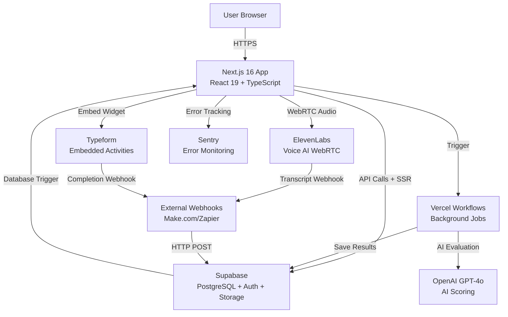
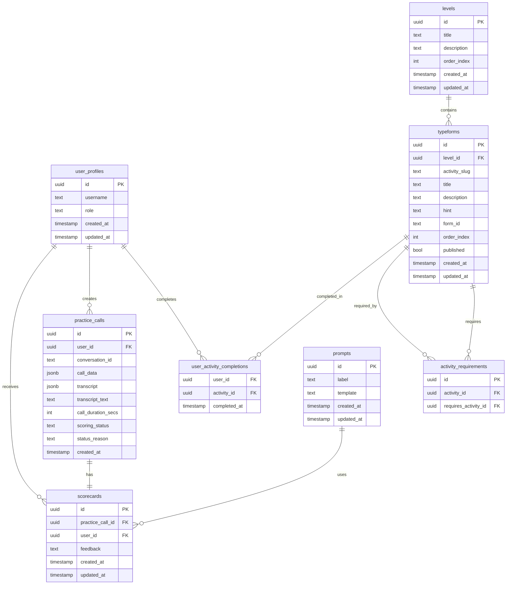
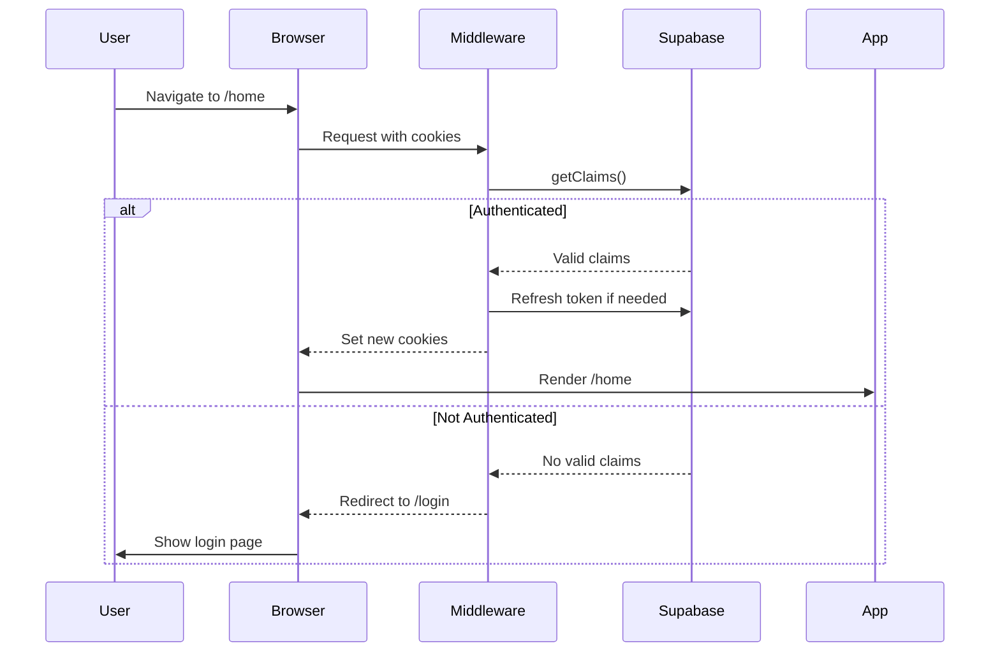
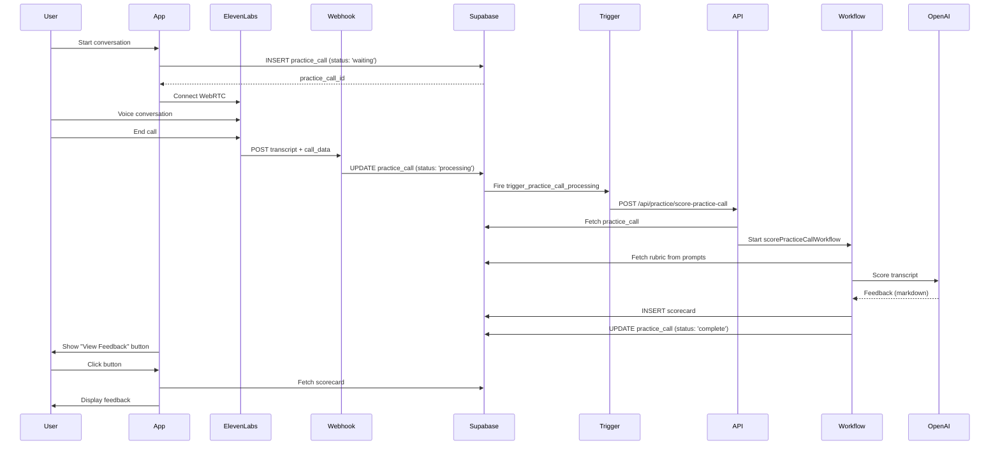
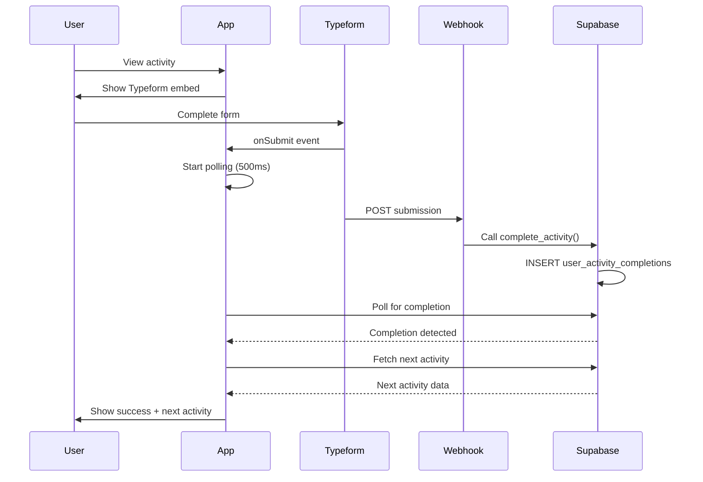
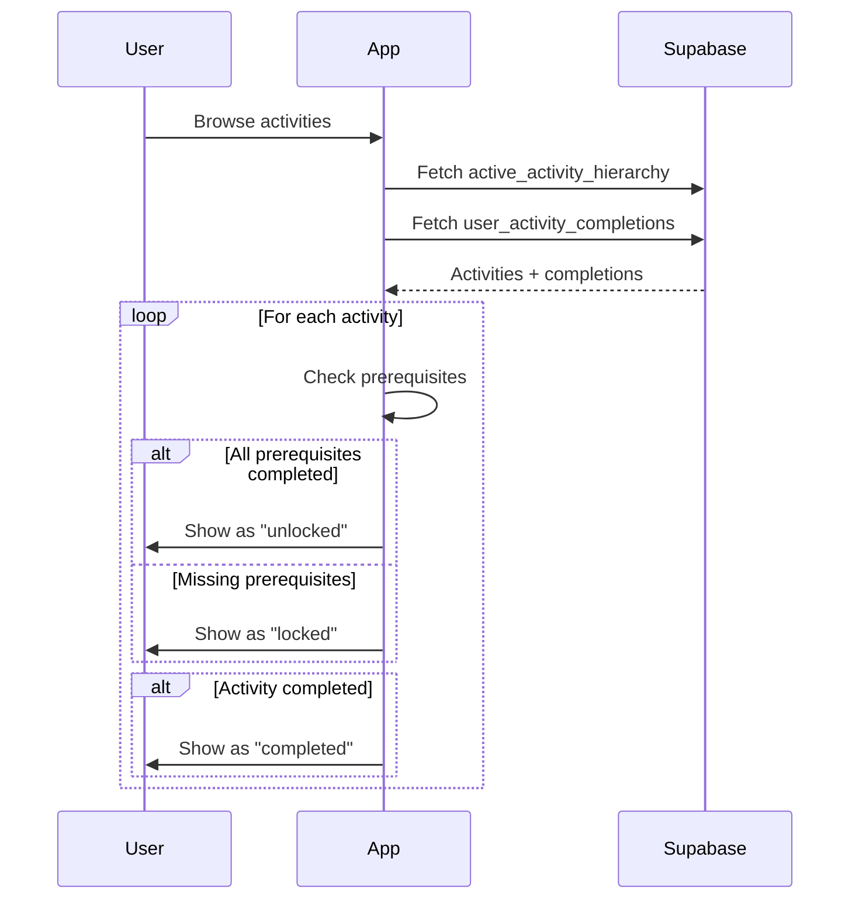

# System Architecture

This document provides a comprehensive overview of the Practice Platform's architecture, including system design, data flow, and key technical decisions.

## Table of Contents

- [Application Overview](#application-overview)
- [High-Level Architecture](#high-level-architecture)
- [Tech Stack](#tech-stack)
- [Database Architecture](#database-architecture)
- [Authentication & Authorization](#authentication--authorization)
- [Key Integrations](#key-integrations)
- [Data Flow Diagrams](#data-flow-diagrams)
- [File Structure](#file-structure)
- [Context Providers](#context-providers)
- [Server vs Client Components](#server-vs-client-components)
- [API Routes](#api-routes)
- [Background Workflows](#background-workflows)
- [Security Considerations](#security-considerations)

## Application Overview

The Practice Platform is an AI-powered coaching application that enables users to:
- Complete structured learning activities organized by levels
- Practice conversations with AI-powered voice agents
- Receive AI-generated feedback and scoring
- Track progress through a prerequisite-based curriculum

**Target Users**: Individuals practicing communication and coaching skills

**Key Value Proposition**: Realistic practice environment with instant, detailed AI feedback

## High-Level Architecture



### Architecture Layers

1. **Presentation Layer** (Next.js + React)
   - Server-side rendering for initial page loads
   - Client-side interactivity with React
   - Responsive UI with Tailwind CSS

2. **Application Layer** (Next.js API Routes)
   - RESTful API endpoints
   - Workflow triggers
   - Webhook handlers

3. **Business Logic Layer** (Supabase Functions + Workflows)
   - Database functions for complex queries
   - Database triggers for automation
   - Async workflows for long-running tasks

4. **Data Layer** (Supabase PostgreSQL)
   - Relational database with Row Level Security
   - Real-time subscriptions
   - File storage

5. **External Services Layer**
   - ElevenLabs for voice AI
   - OpenAI for text generation
   - Typeform for assessments
   - Sentry for monitoring

## Tech Stack

### Frontend

**Framework**: Next.js 16.1.1 (App Router)
- Server Components by default
- Client Components for interactivity
- File-based routing
- Built-in API routes

**UI Library**: React 19.2.3
- Latest React features (Server Components, Actions)
- Concurrent rendering
- Automatic batching

**Styling**: Tailwind CSS 4
- Utility-first CSS
- PostCSS processing
- Custom design system via `globals.css`

**Component Library**: Radix UI
- Accessible primitives
- Unstyled components
- Full keyboard navigation
- Components used: Dialog, Select, Switch, Tooltip, Accordion, etc.

**Animation**: Framer Motion (motion)
- Declarative animations
- Layout animations
- Gesture support

**Icons**: Lucide React
- Consistent icon set
- Tree-shakeable
- SVG-based

**Theme**: next-themes
- Dark/light mode support
- System preference detection
- No flash on load

### Backend

**Database**: Supabase (PostgreSQL 17)
- Managed PostgreSQL
- Built-in authentication
- Row Level Security (RLS)
- Real-time subscriptions
- Storage for files

**ORM/Client**: @supabase/supabase-js + @supabase/ssr
- Type-safe database queries
- Server-side rendering support
- Cookie-based sessions
- Automatic token refresh

**API**: Next.js API Routes
- Serverless functions
- Edge runtime support
- Built-in middleware

**Background Jobs**: Vercel Workflows (workflow@4.0.1-beta.48)
- Step-based workflow orchestration
- Automatic retries
- Durable execution
- Type-safe workflow definitions

### AI & Voice

**Voice AI**: ElevenLabs (@elevenlabs/react@0.12.3)
- Conversational AI agents
- Real-time WebRTC audio
- WebSocket connections
- Transcript generation

**Text AI**: OpenAI (@ai-sdk/openai@3.0.12)
- GPT-4o for scoring
- Vercel AI SDK integration
- Streaming responses
- Structured outputs

### Monitoring & Analytics

**Error Tracking**: Sentry (@sentry/nextjs@10.35.0)
- Error monitoring
- Performance tracking
- Source map uploads
- Release tracking

### Development Tools

**Language**: TypeScript 5
- Type safety
- IntelliSense support
- Compile-time error checking

**Linting**: ESLint 9
- Next.js config
- Custom rules

**Package Manager**: npm
- Lock file for reproducible builds

## Database Architecture

### Schema Overview

The database uses a relational model with the following key entities:



### Key Tables

#### `user_profiles`
- Extends Supabase `auth.users`
- Stores additional user information
- `role` field for admin/user permissions
- One-to-one with auth.users

#### `levels`
- Top-level organization for activities
- Ordered by `order_index`
- Contains multiple activities

#### `typeforms`
- Learning activities
- Linked to Typeform forms via `form_id`
- Can have prerequisites via `activity_requirements`
- `published` flag controls visibility

#### `activity_requirements`
- Many-to-many relationship for prerequisites
- `activity_id` requires `requires_activity_id` to be completed first
- Enables complex prerequisite chains

#### `user_activity_completions`
- Tracks which activities users have completed
- Composite primary key (user_id, activity_id)
- `completed_at` timestamp for progress tracking

#### `practice_calls`
- Records voice conversation sessions
- Stores transcript in both JSONB and text formats
- `scoring_status`: 'waiting' | 'processing' | 'complete' | 'failed' | 'skipped'
- Linked to ElevenLabs via `conversation_id`

#### `scorecards`
- AI-generated feedback for practice calls
- One-to-one with practice_calls
- Stores markdown-formatted feedback
- Links to user for quick access

#### `prompts`
- Rubric templates for AI scoring
- Contains system prompts for OpenAI
- Currently uses first prompt for all scoring

### Database Views

#### `active_activity_hierarchy`
- Denormalized view combining levels, typeforms, and requirements
- Filters to `published = true` activities only
- Aggregates prerequisite IDs into array
- Used for efficient activity browsing

```sql
CREATE VIEW active_activity_hierarchy AS
SELECT 
    l.id as level_id,
    l.title as level_title,
    l.order_index as level_order,
    t.id as activity_id,
    t.activity_slug,
    t.title as activity_title,
    t.description,
    t.hint,
    t.form_id,
    t.order_index as activity_order,
    COALESCE(
        array_agg(ar.requires_activity_id) FILTER (WHERE ar.requires_activity_id IS NOT NULL),
        ARRAY[]::uuid[]
    ) as requires_activity_ids
FROM levels l
JOIN typeforms t ON t.level_id = l.id
LEFT JOIN activity_requirements ar ON ar.activity_id = t.id
WHERE t.published = true
GROUP BY l.id, t.id
ORDER BY l.order_index, t.order_index;
```

### Database Functions

#### `can_user_access_activity(p_user_id UUID, p_activity_id UUID)`
**Purpose**: Check if user has completed all prerequisites for an activity

**Returns**: `BOOLEAN`

**Logic**:
1. Gets all required activity IDs for the target activity
2. Checks if user has completed all of them
3. Returns true if all prerequisites met or no prerequisites exist

**Usage**: Called from client to determine if activity should be locked

#### `complete_activity(p_user_id UUID, p_activity_id UUID)`
**Purpose**: Mark an activity as completed for a user

**Returns**: `VOID`

**Logic**:
- Inserts into `user_activity_completions`
- Uses `ON CONFLICT DO NOTHING` to handle duplicates
- Sets `completed_at` to current timestamp

**Usage**: Called by external webhook when Typeform is submitted

#### `handle_practice_call_processing()`
**Purpose**: Trigger function to start scoring workflow

**Trigger**: `AFTER UPDATE ON practice_calls`

**Condition**: `NEW.scoring_status = 'processing' AND OLD.scoring_status != 'processing'`

**Logic**:
1. Retrieves API URL and key from Supabase Vault
2. Makes HTTP POST to `/api/practice/score-practice-call`
3. Passes `practice_call_id` in request body
4. Uses `pg_net.http_post` for async HTTP request

**Usage**: Automatically fires when practice call status changes to 'processing'

### Database Triggers

#### `trigger_practice_call_processing`
- Fires on UPDATE of `practice_calls` table
- Calls `handle_practice_call_processing()` function
- Enables automatic workflow triggering from database changes

### Row Level Security (RLS)

All tables have RLS enabled with policies:

**General Pattern**:
- Users can read their own data
- Users can insert their own data
- Users can update their own data
- Admins can read/write all data

**Example Policy** (user_activity_completions):
```sql
-- Users can view their own completions
CREATE POLICY "Users can view own completions"
ON user_activity_completions FOR SELECT
USING (auth.uid() = user_id);

-- Users can insert their own completions
CREATE POLICY "Users can complete activities"
ON user_activity_completions FOR INSERT
WITH CHECK (auth.uid() = user_id);
```

## Authentication & Authorization

### Authentication Flow



### Middleware (`proxy.ts` + `lib/supabase/middleware.ts`)

**Purpose**: Protect routes and refresh authentication tokens

**Flow**:
1. Runs on every request (except static assets)
2. Calls `updateSession()` from middleware utility
3. Checks user claims via `supabase.auth.getClaims()`
4. Refreshes token if needed
5. Redirects unauthenticated users to `/login`

**Exempt Routes**:
- `/` (landing page)
- `/login`
- `/sign-up`
- `/forgot-password`
- `/update-password`
- `/_next/*` (Next.js internals)
- `/api/*` (API routes handle their own auth)

### Supabase Clients

#### Browser Client (`lib/supabase/client.ts`)
```typescript
import { createBrowserClient } from '@supabase/ssr'

export const createClient = () =>
  createBrowserClient(
    process.env.NEXT_PUBLIC_SUPABASE_URL!,
    process.env.NEXT_PUBLIC_SUPABASE_PUBLISHABLE_DEFAULT_KEY!
  )
```
- Used in Client Components
- Respects RLS policies
- Uses anon key

#### Server Client (`lib/supabase/server.ts`)
```typescript
import { createServerClient } from '@supabase/ssr'
import { cookies } from 'next/headers'

export const createClient = () => {
  const cookieStore = await cookies()
  
  return createServerClient(
    process.env.NEXT_PUBLIC_SUPABASE_URL!,
    process.env.NEXT_PUBLIC_SUPABASE_PUBLISHABLE_DEFAULT_KEY!,
    {
      cookies: {
        getAll() { return cookieStore.getAll() },
        setAll(cookiesToSet) { /* ... */ }
      }
    }
  )
}
```
- Used in Server Components and API routes
- Respects RLS policies
- Uses anon key
- Manages cookies for session

#### Admin Client (`lib/supabase/admin.ts`)
```typescript
import { createClient } from '@supabase/supabase-js'

export const supabaseAdmin = createClient(
  process.env.NEXT_PUBLIC_SUPABASE_URL!,
  process.env.SUPABASE_SECRET_KEY!
)
```
- Used in workflows and server-side operations
- **Bypasses RLS** - use with caution!
- Uses service role key
- No session persistence

### Authorization

**Role-Based Access**:
- `user` - Standard user permissions
- `admin` - Full access to all data

**Implemented via**:
- RLS policies check `user_profiles.role`
- Client-side checks for UI rendering
- Server-side checks in API routes

## Key Integrations

### ElevenLabs Integration

**Purpose**: Real-time voice conversations with AI agents

**Components**:
- `components/elevenlabs/conversation-bar.tsx` - Main interface
- `components/elevenlabs/conversation.tsx` - Container
- `components/elevenlabs/message.tsx` - Message display
- `components/elevenlabs/live-waveform.tsx` - Audio visualization

**Configuration**:
```typescript
<Conversation
  onConnect={() => {/* ... */}}
  onDisconnect={() => {/* ... */}}
  onMessage={(message) => {/* ... */}}
  onError={(error) => {/* ... */}}
>
  <ConversationBar
    agentId={process.env.NEXT_PUBLIC_ELEVENLABS_AGENT_ID}
    clientTools={{
      dynamicVariables: {
        user_name: userProfile?.username,
        user_id: userId,
        practice_call_id: practiceCallId,
        // ... character details
      }
    }}
  />
</Conversation>
```

**Data Flow**:
1. User clicks "Start Conversation"
2. `usePracticeCall` hook creates `practice_calls` record
3. WebRTC connection established to ElevenLabs
4. Dynamic variables passed to agent
5. Conversation audio streams in real-time
6. On disconnect, conversation data sent to webhook
7. Webhook updates `practice_calls` with transcript

**External Webhook** (Make.com/Zapier):
- Receives POST from ElevenLabs
- Extracts conversation_id, transcript, call_data
- Updates `practice_calls` table
- Sets `scoring_status` to 'processing'

### Typeform Integration

**Purpose**: Embedded learning activities and assessments

**Component**: `components/typeform/typeform-react-widget.tsx`

**Configuration**:
```typescript
<Widget
  id={formId}
  hidden={{
    user_id: userId,
    activity_id: activityId,
    level_id: levelId,
    activity_slug: activitySlug,
    activity_title: activityTitle,
  }}
  onSubmit={() => {
    // Poll for completion
  }}
/>
```

**Data Flow**:
1. User completes Typeform
2. `onSubmit` handler fires in widget
3. Client polls `user_activity_completions` every 500ms
4. External webhook receives Typeform submission
5. Webhook calls `complete_activity()` function
6. Client detects completion
7. Shows success dialog with next activity

**External Webhook** (Make.com/Zapier):
- Receives POST from Typeform
- Extracts hidden fields (user_id, activity_id)
- Calls Supabase function `complete_activity()`

### OpenAI Integration

**Purpose**: AI-powered transcript scoring

**Usage**: `workflows/score-practice-call.ts`

**Configuration**:
```typescript
import { openai } from '@ai-sdk/openai'
import { generateText } from 'ai'

const result = await generateText({
  model: openai('gpt-4o'),
  system: rubricTemplate,
  prompt: `Transcript:\n${transcript}`,
  temperature: 0.7,
})
```

**Prompt Structure**:
- System prompt: Rubric template from `prompts` table
- User prompt: Full conversation transcript
- Temperature: 0.7 for balanced creativity/consistency

**Output**: Markdown-formatted feedback with scores and recommendations

### Sentry Integration

**Purpose**: Error monitoring and performance tracking

**Configuration Files**:
- `sentry.server.config.ts` - Server-side
- `sentry.edge.config.ts` - Edge runtime
- `instrumentation.ts` - Runtime registration

**Features Enabled**:
- Error tracking
- Performance monitoring
- Source map uploads
- Tunnel route `/monitoring` (bypasses ad blockers)
- Automatic Vercel Cron Monitor instrumentation

**Usage**:
```typescript
import * as Sentry from '@sentry/nextjs'

try {
  // ... code
} catch (error) {
  Sentry.captureException(error)
  throw error
}
```

## Data Flow Diagrams

### Practice Call Scoring Flow



### Activity Completion Flow



### Activity Access Check Flow



## File Structure

### App Router Structure (`app/`)

```
app/
├── (app)/                    # Main app layout group
│   ├── layout.tsx            # App layout with auth check
│   ├── home/
│   │   └── page.tsx          # Home page (SSR)
│   ├── browse/
│   │   └── page.tsx          # Activity browser (SSR)
│   ├── activity/
│   │   └── [id]/
│   │       └── page.tsx      # Activity detail (SSR)
│   ├── practice/
│   │   ├── layout.tsx        # Practice layout
│   │   ├── page.tsx          # Voice chat interface (Client)
│   │   └── scorecard/
│   │       └── [id]/
│   │           └── page.tsx  # Feedback display (SSR)
│   └── settings/
│       └── page.tsx          # User settings (SSR)
├── (auth)/                   # Auth layout group
│   ├── layout.tsx            # Auth layout (centered)
│   ├── login/
│   │   └── page.tsx          # Login form
│   ├── sign-up/
│   │   └── page.tsx          # Sign up form
│   ├── forgot-password/
│   │   └── page.tsx          # Password reset
│   └── update-password/
│       └── page.tsx          # Password update
├── api/                      # API routes
│   ├── practice/
│   │   └── score-practice-call/
│   │       └── route.ts      # Workflow trigger
│   ├── signup/
│   │   └── route.ts          # User signup workflow
│   └── sentry-example-api/
│       └── route.ts          # Sentry test
├── layout.tsx                # Root layout
├── page.tsx                  # Landing page
├── globals.css               # Global styles
├── global-error.tsx          # Global error boundary
└── favicon.ico               # Favicon
```

### Components Structure (`components/`)

```
components/
├── activities/               # Activity-related components
│   ├── activities-browser.tsx
│   └── activity-card.tsx
├── auth/                     # Authentication components
│   ├── login-form.tsx
│   ├── sign-up-form.tsx
│   ├── forgot-password-form.tsx
│   ├── update-password-form.tsx
│   ├── auth-buttons.tsx
│   └── logout-button.tsx
├── elevenlabs/               # ElevenLabs voice components
│   ├── conversation-bar.tsx
│   ├── conversation.tsx
│   ├── message.tsx
│   ├── response.tsx
│   ├── live-waveform.tsx
│   ├── avatar.tsx
│   ├── orb.tsx
│   ├── textarea.tsx
│   ├── tooltip.tsx
│   └── shimmering-text.tsx
├── practice/                 # Practice session components
│   ├── voice-chat.tsx
│   └── post-call-dialog.tsx
├── typeform/                 # Typeform integration
│   ├── typeform-react-widget.tsx
│   ├── activity-completion-dialog.tsx
│   └── fab-feedback.tsx
├── home/                     # Home page components
│   ├── home-user-greeting.tsx
│   └── recommended-activities.tsx
├── settings/                 # Settings components
│   ├── settings-form-item.tsx
│   └── update-username-form.tsx
├── layout/                   # Layout components
│   ├── app-header.tsx
│   ├── nav-sheet.tsx
│   ├── page-container.tsx
│   ├── page-heading.tsx
│   └── responsive-wrapper.tsx
├── theme/                    # Theme components
│   ├── theme-provider.tsx
│   └── theme-switch.tsx
└── ui/                       # Reusable UI components
    ├── button.tsx
    ├── input.tsx
    ├── card.tsx
    ├── dialog.tsx
    ├── select.tsx
    ├── switch.tsx
    ├── tooltip.tsx
    ├── accordion.tsx
    ├── alert-dialog.tsx
    ├── drawer.tsx
    ├── field.tsx
    ├── item.tsx
    ├── label.tsx
    ├── markdown.tsx
    ├── scroll-area.tsx
    ├── separator.tsx
    ├── sonner.tsx
    └── spinner.tsx
```

### Library Structure (`lib/`)

```
lib/
├── contexts/                 # React contexts
│   └── user-profile-context.tsx
├── supabase/                 # Supabase utilities
│   ├── client.ts             # Browser client
│   ├── server.ts             # Server client
│   ├── admin.ts              # Admin client
│   ├── middleware.ts         # Auth middleware
│   ├── actions.ts            # Server actions
│   ├── user.ts               # User utilities
│   └── types.ts              # Generated types
├── utils/                    # Utility functions
│   ├── activity-progress.tsx # Progress calculations
│   └── get-next-activity.ts  # Next activity logic
└── utils.ts                  # General utilities (cn, etc.)
```

## Context Providers

### User Profile Context (`lib/contexts/user-profile-context.tsx`)

**Purpose**: Provide user profile data throughout the app

**Provider Location**: `app/(app)/layout.tsx`

**Data Fetched**:
```typescript
{
  id: string
  username: string | null
  role: 'admin' | 'user'
  created_at: string
  updated_at: string
}
```

**Usage**:
```typescript
'use client'
import { useUserProfile } from '@/lib/contexts/user-profile-context'

export function MyComponent() {
  const userProfile = useUserProfile()
  
  return <div>Welcome, {userProfile?.username}!</div>
}
```

**Fetching Strategy**:
- Fetched server-side in layout
- Passed to client context provider
- Cached with React `cache()`
- Revalidated on profile updates

### Theme Provider (`components/theme/theme-provider.tsx`)

**Purpose**: Manage dark/light mode

**Provider Location**: `app/layout.tsx` (root)

**Features**:
- System preference detection
- Persistent theme selection
- No flash on load
- Smooth transitions

## Server vs Client Components

### Server Components (Default)

**Used for**:
- Pages with data fetching
- SEO-important content
- Static content
- Layouts

**Examples**:
- `app/(app)/home/page.tsx` - Fetches activities server-side
- `app/(app)/browse/page.tsx` - Fetches all activities
- `app/(app)/activity/[id]/page.tsx` - Fetches specific activity
- `app/(app)/practice/scorecard/[id]/page.tsx` - Fetches scorecard

**Benefits**:
- Smaller bundle size
- Better performance
- Direct database access
- SEO-friendly

### Client Components ('use client')

**Used for**:
- Interactive UI
- State management
- Event handlers
- Browser APIs
- Third-party libraries (ElevenLabs, Typeform)

**Examples**:
- `app/(app)/practice/page.tsx` - Voice chat interface
- `components/elevenlabs/conversation-bar.tsx` - WebRTC
- `components/typeform/typeform-react-widget.tsx` - Typeform embed
- `components/auth/login-form.tsx` - Form handling

**Benefits**:
- Full React features
- Client-side interactivity
- Access to browser APIs

### Hybrid Pattern

**Common pattern**: Server Component wraps Client Component

```typescript
// app/page.tsx (Server Component)
import { ClientComponent } from './client-component'

export default async function Page() {
  const data = await fetchData() // Server-side
  
  return <ClientComponent data={data} />
}

// client-component.tsx (Client Component)
'use client'
export function ClientComponent({ data }) {
  const [state, setState] = useState()
  // Interactive logic
}
```

## API Routes

### `/api/practice/score-practice-call` (POST)

**Purpose**: Trigger AI scoring workflow for a practice call

**Authentication**: Bearer token (WORKFLOW_API_KEY)

**Request**:
```typescript
{
  practice_call_id: string
}
```

**Response**:
```typescript
{
  message: string
  run_id: string
  practice_call_id: string
  duration_secs: number
}
```

**Logic**:
1. Validate API key from Authorization header
2. Fetch practice call from database
3. Check call duration (minimum 60 seconds)
4. If too short: update status to 'skipped', return error
5. If valid: start `scorePracticeCallWorkflow`
6. Return workflow run ID

**Error Handling**:
- 401: Invalid or missing API key
- 400: Missing practice_call_id
- 404: Practice call not found
- 400: Call too short (< 60 seconds)
- 500: Workflow start failed

### `/api/signup` (POST)

**Purpose**: Start user signup workflow

**Authentication**: None (public endpoint)

**Request**:
```typescript
{
  email: string
}
```

**Response**:
```typescript
{
  message: string
}
```

**Logic**:
1. Start `handleUserSignup` workflow asynchronously
2. Return immediately (non-blocking)
3. Workflow handles user creation and emails

**Note**: Currently uses mock functions, not integrated with actual email service

## Background Workflows

### Score Practice Call Workflow

**File**: `workflows/score-practice-call.ts`

**Trigger**: Database trigger → API endpoint

**Steps**:

1. **fetchPracticeCall**
   - Fetches practice call with transcript
   - Returns call data and transcript text

2. **fetchRubric**
   - Fetches first prompt from `prompts` table
   - Returns rubric template for scoring

3. **scoreWithAI**
   - Calls OpenAI GPT-4o
   - System prompt: rubric template
   - User prompt: transcript
   - Returns markdown feedback

4. **saveScorecard**
   - Inserts scorecard into database
   - Links to practice call and user

5. **Update Status**
   - Sets `scoring_status` to 'complete'
   - Or 'failed' with error message

**Error Handling**:
- Each step wrapped in try/catch
- Errors logged and saved to database
- Status updated to 'failed' with reason

**Duration**: Typically 5-15 seconds depending on transcript length

### User Signup Workflow

**File**: `workflows/user-signup.ts`

**Trigger**: API endpoint `/api/signup`

**Steps**:

1. **createUser**
   - Creates user record (mock)

2. **sendWelcomeEmail**
   - Sends welcome email (mock, 30% failure rate)

3. **sleep("5s")**
   - 5 second delay

4. **sendOnboardingEmail**
   - Sends onboarding email (mock)

**Note**: Currently for demonstration only, not integrated with actual services

## Security Considerations

### Environment Variables

**Never commit**:
- `.env.local` (already in `.gitignore`)
- API keys
- Database credentials

**Public variables** (safe in browser):
- `NEXT_PUBLIC_SUPABASE_URL`
- `NEXT_PUBLIC_SUPABASE_PUBLISHABLE_DEFAULT_KEY`
- `NEXT_PUBLIC_ELEVENLABS_AGENT_ID`

**Secret variables** (server-only):
- `SUPABASE_SECRET_KEY`
- `WORKFLOW_API_KEY`
- `OPENAI_API_KEY`
- `SENTRY_AUTH_TOKEN`

### Row Level Security (RLS)

**All tables have RLS enabled**:
- Users can only access their own data
- Admins can access all data
- Policies checked on every query

**Bypassing RLS**:
- Only use admin client when necessary
- Validate user permissions manually
- Log admin actions

### API Authentication

**Workflow endpoints**:
- Require Bearer token
- Token stored in Supabase Vault
- Token passed by database trigger

**Example**:
```typescript
const authHeader = request.headers.get('authorization')
if (!authHeader?.startsWith('Bearer ')) {
  return new Response('Unauthorized', { status: 401 })
}

const token = authHeader.substring(7)
if (token !== process.env.WORKFLOW_API_KEY) {
  return new Response('Invalid token', { status: 401 })
}
```

### Input Validation

**Always validate**:
- User input in forms
- API request bodies
- URL parameters
- File uploads

**Use**:
- TypeScript for type safety
- Zod for runtime validation
- Supabase RLS for data access

### HTTPS & CORS

**Production**:
- Always use HTTPS
- Configure CORS appropriately
- Set secure cookie flags

**Development**:
- HTTP acceptable for localhost
- Permissive CORS for testing

### Webhook Security

**External webhooks should**:
- Verify signatures (if available)
- Use HTTPS
- Validate payload structure
- Rate limit requests
- Log all attempts

**Current implementation**:
- ⚠️ No signature verification (add in production)
- ⚠️ No rate limiting (add in production)

## Performance Considerations

### Server-Side Rendering (SSR)

**Benefits**:
- Faster initial page load
- Better SEO
- Reduced client bundle size

**Used for**:
- Home page
- Browse page
- Activity pages
- Scorecard pages

### Client-Side Rendering (CSR)

**Benefits**:
- Instant navigation
- Rich interactivity
- Real-time updates

**Used for**:
- Practice interface
- Voice chat
- Interactive forms

### Caching Strategy

**React Cache**:
```typescript
import { cache } from 'react'

export const getUserProfile = cache(async (userId: string) => {
  // Fetched once per request
})
```

**Next.js Cache**:
- Static pages cached by default
- Dynamic pages revalidated on demand
- API routes not cached

### Bundle Optimization

**Code splitting**:
- Automatic with Next.js App Router
- Dynamic imports for large components
- Lazy loading for below-fold content

**Tree shaking**:
- Enabled for all dependencies
- Sentry configured for tree shaking
- Lucide icons tree-shakeable

## Deployment Architecture

See [DEPLOYMENT.md](DEPLOYMENT.md) for detailed deployment instructions.

**Recommended stack**:
- **Hosting**: Vercel (optimized for Next.js)
- **Database**: Supabase (managed PostgreSQL)
- **Workflows**: Vercel Workflows (built-in)
- **Monitoring**: Sentry (error tracking)

**Production considerations**:
- Set up production Supabase project
- Configure environment variables
- Set up external webhooks
- Enable monitoring and logging
- Configure custom domain
- Set up CI/CD pipeline

---

This architecture is designed for scalability, maintainability, and developer experience. The separation of concerns, use of modern frameworks, and integration of best-in-class services provide a solid foundation for growth.
